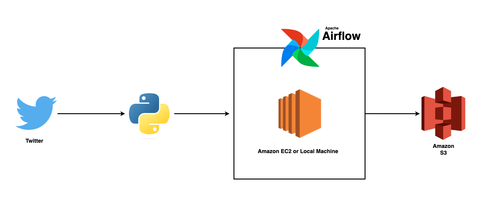

# Twitter Data Pipeline with Airflow and Python

## Overview:

I recently took on a project related to data engineering. The aim was to build a data pipeline that would efficiently collect and analyze large amounts of Twitter data.
I utilized Python, Apache Airflow, and Amazon Web Services (AWS) to complete the task. Although I was able to extract data from the Twitter API using Python, perform data transformations and processing, deploy the processed data to an Apache Airflow instance on AWS EC2, and store the data on AWS S3 for further analysis.  

## Project Roadmap:

In this project, I applied several concepts related to data engineering to build a robust and efficient data pipeline for collecting and analyzing Twitter data. The first step was to create an architecture diagram of the pipeline, which helped me to visualize the flow of data and understand how each component would interact with each other.

Next, I installed and imported Apache Airflow, a powerful platform used for scheduling and managing workflows. Using Airflow, I was able to define the directed acyclic graph (DAG) and the individual tasks that would make up the pipeline.

Once the DAG was set up, I focused on executing the pipeline, which involved setting up the Twitter API and obtaining the API key and secret key. After successfully executing the pipeline, I deployed the code on Apache Airflow, ensuring that the pipeline would run smoothly and efficiently.

## Architecture:  
  
  

## Technologies Used:  
  
**1. Python and Pandas**  
**2. Apache Airflow**  
**3. Amazon EC2**  
**4. Amazon S3**  
  
## What did i learn through this project:  

Through this project, I gained hands-on experience in building a data pipeline from start to finish, which greatly enhanced my understanding of data engineering. I learned how to use Apache Airflow to schedule and manage workflows, as well as how to extract data from the Twitter API and process it for further analysis.  
  
Additionally, working with the Twitter API and learning about its limitations and restrictions gave me a deeper understanding of how APIs can be used to collect data. I also gained experience in deploying code on AWS EC2 and storing data on S3, which are critical skills for any data engineer.  
  
Overall, this project provided me with a challenging yet rewarding experience and allowed me to apply my knowledge of data engineering concepts in a real-world setting. I am confident that the skills and knowledge I gained from this project will be invaluable as I continue to pursue a career in the field of data engineering.
